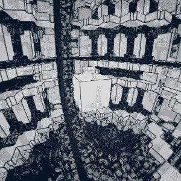

# Everyday One Motion - 20160310 "IFS Parallelotope"  

  

JavaScript, WebGL, Raymarching  

[Everyday One Motion](http://motions.work/motion/140)  
[Demo Page](http://fms-cat.github.io/eom_20160310)  

## IFS Parallelotope  

[ Type ] 全般のジオメトリ生成に用いた、フラクタル系のdistance function（距離関数）がどう図形を生成しているのか、自分でも理解していなかったので、せっかくなのでGIFアニメにしてみました。  
結論から言うと、**よくわかりませんでした**。  

## movement.js

ということで、本題とはあまり関係のない話をしてしまうのですが、今回は「movement.js」という、アニメーションを簡単に実現できるライブラリを試作・試用してみました。  
現時点では、線形移動・指数補間・バネシミュレーション・重力シミュレーション、が利用可能です。  
今回はほぼすべてのアニメーションにバネシミュレーション（[20160211](https://github.com/FMS-Cat/eom_20160211)）を用いました。とてもスムーズなアニメーションが実現できました。  

このライブラリは元々Lua用に作ったもので、Stepmaniaにおいてアニメーションを簡単に記述できるように開発しました。  
幸い、JSとLuaは文法がとても似ているため、簡単に移植ができたため、今回のアニメーションの記述のために採用してみました。どうしてもカメラのアニメーションをGLSLのみでやるのは非常に困難ですので…  
もう少し開発してみて、よさ気であれば正式に公開します。  

<iframe width="420" height="315" src="https://www.youtube.com/embed/2Bhl4plHif8" frameborder="0" allowfullscreen></iframe>

さらに、timelineという関数を導入して、キーフレームを打っていくような感覚でアニメーションを実装することが可能となりました。  

```JavaScript
// 例: こんな感じでアニメーションを記述できます

let timeline = {
  0.0: function() { // 0.0秒にすること
    cameraX.set( { target: 1.0 } ); // カメラのx座標を1.0に移動
  },
  0.5: function() { // 0.5秒にすること
    cubeRotateY.set( { target: PI } ); // キューブを180度回転
  }
};
```

欠点として、三次元ベクトルなど、スカラ以外を補完するのが少々面倒という点が挙げられます。GLSLなら簡単なのになあ〜〜〜  
